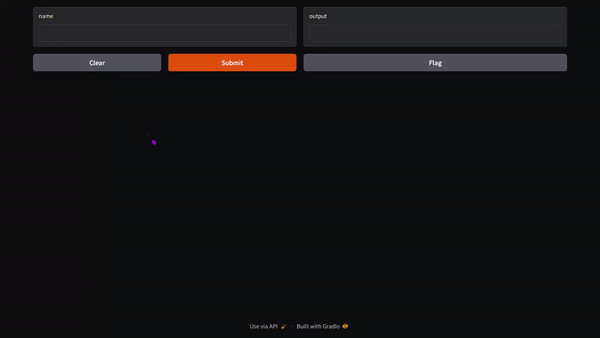
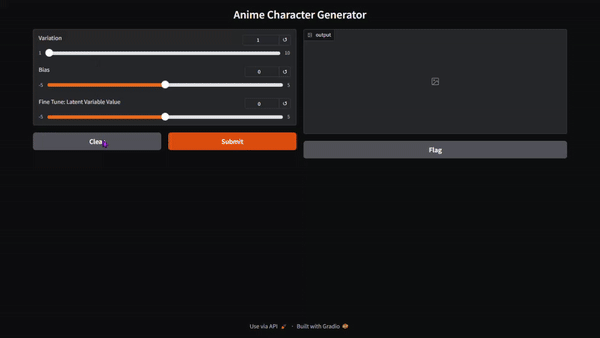

 ## First commit in setting up the enviroment and installing gradio
1. mkdir on cmd called AnimeCharImg-Gnrtr
2. Create the virtual environment and activate the virutal environment
3. Install the required packages pip install --upgrade gradio
4. Create a simple demo with gradio and launch 


# Output 😁⭐😊
### Screen Recording Output 


### Screen Shot Output
 

## Setting up the demo application 
This creates a Gradio interface using the gr.Interface class. It specifies the make_image function as the main function, defines the input sliders and their ranges, sets the title and CSS styling, and specifies the output as an image with the specified width and height. Finally, the .launch() method is called to launch the Gradio interface.

Creating the application The code sets up a Gradio interface for creating anime characters using a pre-trained model. Here is a brief explanation of each step

1. Import the necessary libraries for image transformation, PyTorch, and Gradio.
```python
import requests
import torch
import torch.nn as nn
from torchvision.transforms.functional import to_pil_image
from PIL import Image  # For resizing images with high quality
import gradio as gr
```

2. Download the pretrained model and save it in the system.
```python
url = "https://cf-courses-data.s3.us.cloud-object-storage.appdomain.cloud/IBM-GPXX0GD8EN/G_trained.pth"
response = requests.get(url)


with open("G_trained.pth", "wb") as f:
    f.write(response.content)
```

3. This defines the size of the latent vector, which is the input to the generator.
```python
# This defines the size of the latent vector, which is the input to the generator. 
latent_vector_size = 128
```


4. This block of code defines a custom generator class that inherits `fromnn.Modulein` PyTorch. It specifies the architecture of the generator network
```python
class Generator(nn.Module):
    def __init__(self):
        super(Generator, self).__init__()
        self.main = nn.Sequential(
            nn.ConvTranspose2d(latent_vector_size, 64 * 8, 4, 1, 0, bias=False),
            nn.BatchNorm2d(64 * 8),
            nn.ReLU(True),
            nn.ConvTranspose2d(64 * 8, 64 * 4, 4, 2, 1, bias=False),
            nn.BatchNorm2d(64 * 4),
            nn.ReLU(True),
            nn.ConvTranspose2d(64 * 4, 64 * 2, 4, 2, 1, bias=False),
            nn.BatchNorm2d(64 * 2),
            nn.ReLU(True),
            nn.ConvTranspose2d(64 * 2, 64, 4, 2, 1, bias=False),
            nn.BatchNorm2d(64),
            nn.ReLU(True),
            nn.ConvTranspose2d(64, 3, 4, 2, 1, bias=False),
            nn.Tanh()
        )

    def forward(self, input):
        return self.main(input)
```


5. This creates an instance of the Generator class, which represents the generator network.
```python
# Load the generator model
G = Generator()
```


6. These lines set the device to CPU and load the saved state dictionary of the generator model from theG_trained.pthfile.
```python
device = torch.device("cpu")
G.load_state_dict(torch.load("G_trained.pth", map_location=device))
```


7. This defines a function named make_image that takes input parameters a, b, value and generates an image using the generator network.
```python
def make_image(a, b, value):
```

8. This generates an image by passing the latent vector z through the generator network G. The resulting output is detached from the computational graph, and the dimensions are squeezed to remove any singleton dimensions.
```python
    z = a * torch.randn(1, latent_vector_size, 1, 1) + b
    Xhat = G(z)[0].detach().squeeze(0)
```


9. This performs min-max normalization on the image tensor Xhat, scaling its values between 0 and 1.
```python
    Xhat = (Xhat - Xhat.min()) / (Xhat.max() - Xhat.min())
```


10. These lines define the title and CSS styling for the Gradio interface.
```python
title = "Anime Character Generator"
css = ".output_image {height: 60rem !important; width: 100% !important;}"
```

## **Expected Outputs**

### **Screen Recording Output**


### **Screenshot**
.png)

---

## **Features**

- **Interactive Sliders**: Adjust variation, bias, and latent variable value.
- **High-Quality Resizing**: Output images are resized to 512x512 using high-quality filtering.
- **Gradio Interface**: Simple and intuitive UI for generating anime characters.

---

## **How It Works**

1. **Model Initialization**: Loads a pre-trained generator model.
2. **Image Generation**:
   - A latent vector (`z`) is created using random noise scaled by the `Variation` slider.
   - The generator processes `z` to create a raw image tensor.
   - The image is normalized and converted to a high-quality PIL image.
3. **Gradio Interface**:
   - Users adjust sliders to control `Variation`, `Bias`, and `Fine Tune`.


# Creating Dockerfile to Deploying the Application

This project uses a `Dockerfile` to containerize a Python application.

## Steps to Use

1. **Clone the Repository**  
   Ensure all necessary files (`Dockerfile`, `requirements.txt`, and `demo.py`) are in the same directory.

2. **Build the Docker Image**  
   Run this command to build the Docker image:  
   ```bash
   docker build -t python-app .
   ```

3. **Run the Docker Container**  
   Use this command to start the container:  
   ```bash
   docker run -it --rm python-app
   ```

--- 

## How It Works

- The `Dockerfile` does the following:
  1. Uses a Python base image.
  2. Sets `/app` as the working directory.
  3. Copies `requirements.txt` and installs dependencies.
  4. Copies all application files into the image.
  5. Runs `demo.py` when the container starts.

---

## Requirements

- Docker installed on your system.
- A `requirements.txt` file with dependencies.
- A `demo.py` script as the application entry point.

---

## Example Command to Install Dependencies

If you want to test locally, you can install the dependencies:  
```bash
pip install -r requirements.txt
```

--- 
## Helpful Resources

Here are two YouTube videos that helped me understand this concept better:
1. [How to install Docker on Windows - 2024 [ step by step guide ]
](https://youtu.be/ZyBBv1JmnWQ?si=wcev611qDbaikzh1) - *This is a step by step guide , covering how to setup and enable wsl2 and then install docker.*

2. [How to “Dockerize” Your Python Applications | How To Build And Run A Python App In Docker Container](https://youtu.be/KUECJHlV1LE?si=FqdNpmF-3XuAGeEM) - *Docker is an open-source platform that makes it easy to build, ship, and run distributed applications.*
